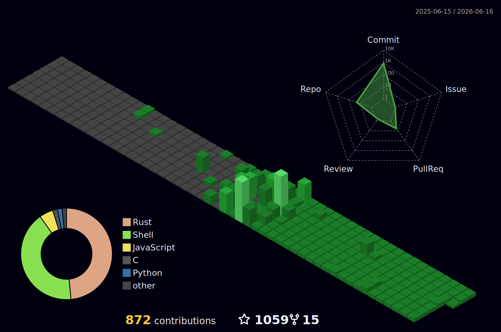

<div align="center">

<!-- 超炫动态头图 -->


<!-- 多行打字动画 -->
<a href="https://git.io/typing-svg"></a>

<!-- 社交徽章 -->
<p>
  <a href="http://jvav.中国"></a>
  <a href="https://github.com/J-x-Z"></a>
  
  
</p>

<!-- 动态状态徽章 -->
<p>
  
  
  
  
</p>

---


## 📊 GitHub Analytics

<div align="center">

<!-- 统计卡片 -->


<!-- 语言统计 -->


<!-- 贡献图 -->


</div>

<!-- 活动图表 -->
<div align="center">
  
</div>

---

## 🏆 Achievements & Trophies

<div align="center">

<!-- 奖杯墙 -->


<!-- 成就进度条 -->


</div>


## 🐍 Contribution Snake

<picture>
  <source media="(prefers-color-scheme: dark)" srcset="https://raw.githubusercontent.com/J-x-Z/J-x-Z/output/github-contribution-grid-snake-dark.svg">
  <source media="(prefers-color-scheme: light)" srcset="https://raw.githubusercontent.com/J-x-Z/J-x-Z/output/github-contribution-grid-snake.svg">
  
</picture>

---

## 🏙️ 3D Contribution City



---

## 📈 Detailed Metrics

<details>
<summary>🔍 <b>Click to expand Advanced Analytics</b></summary>
<br>

<div align="center">

<!-- GitHub Metrics -->


</div>

### 📊 Coding Activity

```text
Rust         ████████████████████░░   85.2%
C            ██████░░░░░░░░░░░░░░░   08.3%
C++          ███░░░░░░░░░░░░░░░░░░   04.1%
Python       █░░░░░░░░░░░░░░░░░░░░   01.8%
Other        ░░░░░░░░░░░░░░░░░░░░░   00.6%
```

### ⏱️ Productivity Stats

- 🌅 **Morning**: 15% of commits
- 🏙️ **Daytime**: 45% of commits  
- 🌆 **Evening**: 30% of commits
- 🌃 **Night**: 10% of commits (Coffee-fueled sessions)

### 💻 Development Environment

```yaml
OS: macOS Sonoma / Arch Linux
Editor: Neovim / VSCode
Shell: zsh with oh-my-zsh
Terminal: Alacritty / iTerm2
WM: yabai (macOS) / i3wm (Linux)
```

</details>


## 💬 Random Dev Quote

<div align="center">


</div>

---

## 🎨 Pinned Repositories

<div align="center">

<a href="https://github.com/J-x-Z/cocoa-way">
  
</a>


<a href="https://github.com/J-x-Z/waypipe-darwin">
  
</a>

<a href="https://github.com/J-x-Z/AetherOS">
  
</a>

</div>


